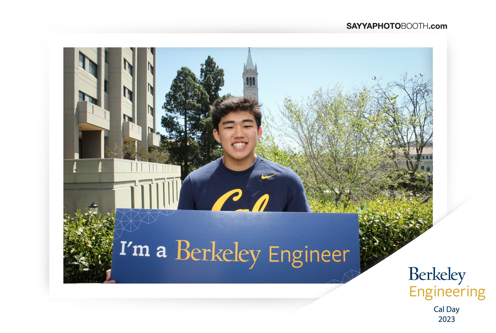

# Ryan Tom - Personal Website

## About Me
### Hi! My name is Ryan Tom and I am currently a rising First Year at the University of California, Berkeley. I am a declared bioengineering major, but am also considering minors in EECS or Data Science to expand my skillset. I am from Fresno, CA (about 3 hours southeast of Berkeley), and have 1 older borther who graudated from UC Berkeley and an older sister who plays basketball at UC Irvine. In the little free time I've had this summer, I've enjoyed playing basketball at the RSF and trying to meet as many new people as I can!

# Projects
## [TransparentAP](https://www.transparentap.com)
AP Course Planner that includes course synopsis, prerequisiites, estimated workload, avg. course difficulty, etc.

